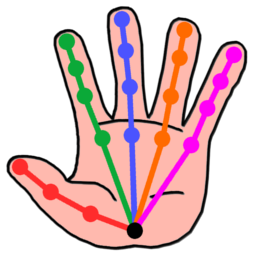

<h1 align="center">
  
  <br>
  Yoha 
  <br>
</h1>
<h4 align="center">A practical hand tracking engine. </h4>
<br>

</img>

<h2>
  Quick Links:
</h2>
<ul>
  <li><a href="https://handtracking.io/draw_demo" target="_blank">Demo</a> <a href="https://github.com/handtracking-io/yoha/blob/master/src/demos/draw/entry.ts">(Code)</a></li>
  <li><a href="https://github.com/handtracking-io/yoha/tree/master/docs">Docs</a></li>
  <li><a href="https://handtracking.io">Website</a></li>
  <li><a href="https://join.slack.com/t/handtrackingio/shared_invite/zt-x4y5rbls-6_1IDAlndbXvIoaWZqcLIA">Slack</a></li>
  <li><a href="https://www.npmjs.com/package/@handtracking.io/yoha">npm</a></li>
</ul>

<h2>Installation</h2>

`npm install @handtracking.io/yoha`

Please note:

- You need to serve the files from `node_modules/@handtracking.io/yoha` since the library needs to download the model files from here. (<a href="https://github.com/handtracking-io/yoha/blob/1aa0217e63a66113b2517bbca2cb60967881e505/webpack.config.js#L48">Webpack Example</a>)
- You need to serve your page with https for webcam access. (<a href="https://github.com/handtracking-io/yoha/blob/1aa0217e63a66113b2517bbca2cb60967881e505/webpack.config.js#L20">Webpack Example</a>)
- You <i>should</i> use cross-origin isolation as it improves the engine's performance in certain scenarios. (<a href="https://github.com/handtracking-io/yoha/blob/1aa0217e63a66113b2517bbca2cb60967881e505/webpack.config.js#L15">Webpack Example</a>)

<h2>Description</h2>

Yoha is a hand tracking engine that is built with the goal of being a versatile solution
in practical scenarios where hand tracking is employed to add value to
an application. While ultimately the goal is to be a general purpose hand
tracking engine supporting any hand pose, the engine evolves
around specific hand poses that users/developers find useful. These poses 
are detected by the engine which allows to build applications with meaningful interactions. 
See the <a href="https://handtracking.io/draw_demo" target="_blank">demo</a> for an example.

Yoha is currently in beta.

About the name: Yoha is short for ("<b>Yo</b>ur <b>Ha</b>nd Tracking").

## Language Support

Yoha is currently available for the web via JavaScript. More languages will be added
in the future. If you want to port Yoha to another language and need help feel free reach out.

## Technical Details

Yoha was built from scratch. It uses a custom neural
network trained using a custom dataset. The backbone for the
inference in the browser is currently <a
target="_blank" href="https://github.com/tensorflow/tfjs">TensorFlow.js</a> 

### Features:

<ul>
  <li>Detection of 21 2D-landmark coordinates (single hand).</li>
  <li>Hand presence detection.</li>
  <li>Hand orientation (left/right hand) detection.</li>
  <li>Inbuilt pose detection.</li>
</ul>

#### Supported Hand Poses:

<ul>
  <li>Pinch (index finger and thumb touch)</li>
  <li>Fist</li>
</ul>

Your desired pose is not on this list? Feel free to create an <a href="https://github.com/handtracking-io/yoha/issues/new/choose">issue</a> for it.
### Performance

Yoha was built with performance in mind. It is able to provide realtime user
experience on a broad range of laptops and desktop devices. The performance
on mobile devices is not great which hopefuly will change with the further
development of inference frameworks like 
<a target="_blank" href="https://github.com/tensorflow/tfjs">TensorFlow.js</a>

Please note that native inference speed can not be compared
with the web inference speed. Differently put, if you were to 
run Yoha natively it would be much faster than via the web
browser.

## Minimal Example

- [Source](https://github.com/handtracking-io/yoha/tree/main/example/)
- Running locally:

```
git clone https://github.com/handtracking-io/yoha && \
cd yoha/example && \
yarn && \
yarn start
```

## Drawing Demo

- [Live Version](https://handtracking.io/draw_demo)
- [Source](https://github.com/handtracking-io/yoha/tree/main/src/demos/draw)
- Running locally:
```
git clone https://github.com/handtracking-io/yoha && \
cd yoha && \
./download_models.sh && \
yarn && \
yarn start
```

## Contact:
- <a href="mailto:benjamin@handtracking.io">benjamin@handtracking.io</a>
- <a href="https://join.slack.com/t/handtrackingio/shared_invite/zt-x4y5rbls-6_1IDAlndbXvIoaWZqcLIA">Slack</a>

